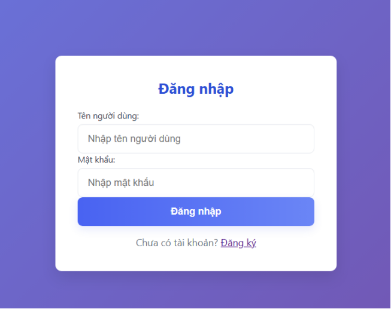
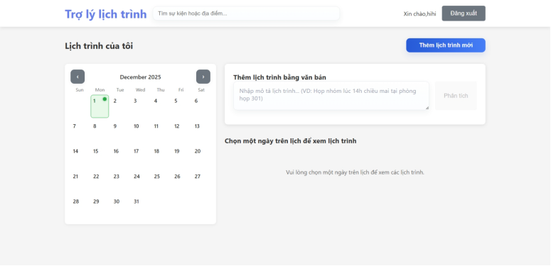
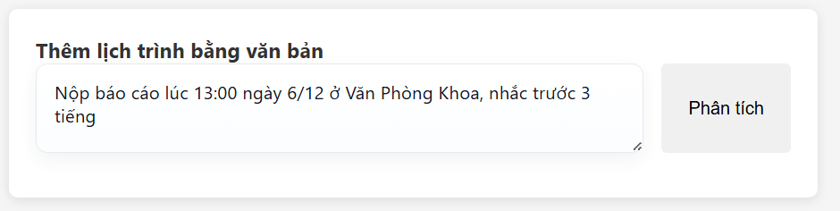
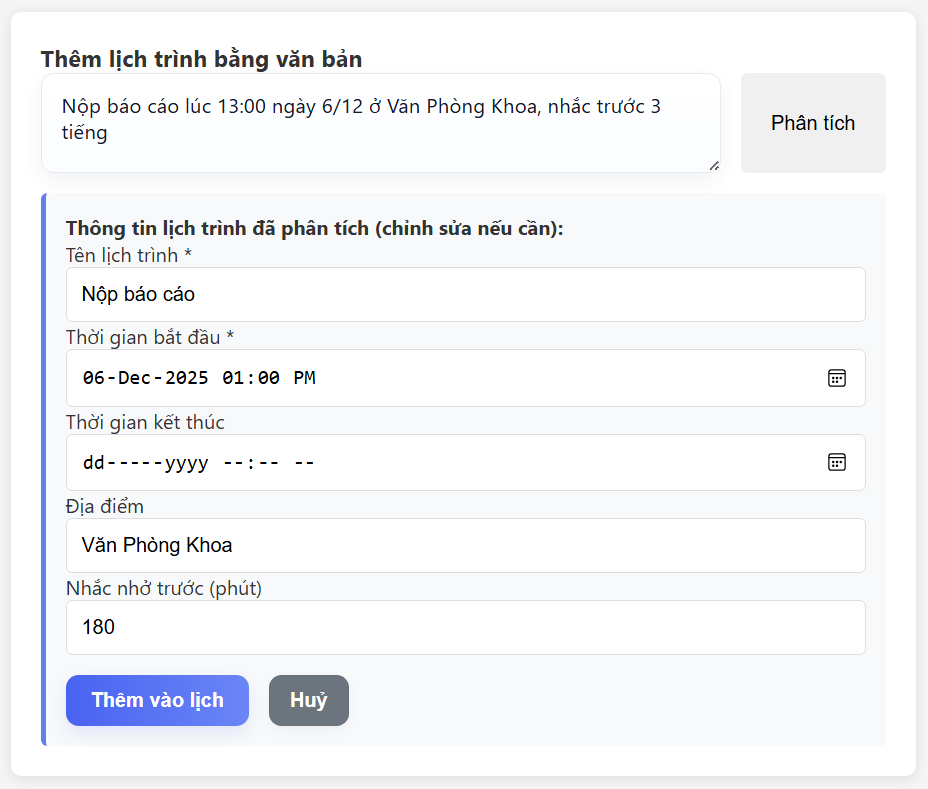
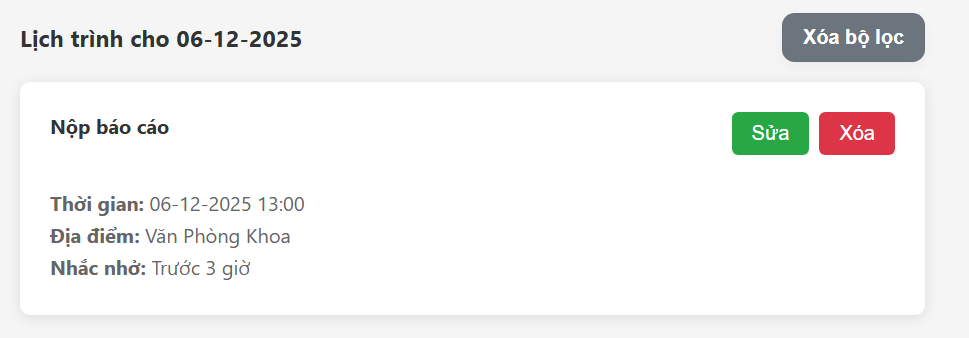
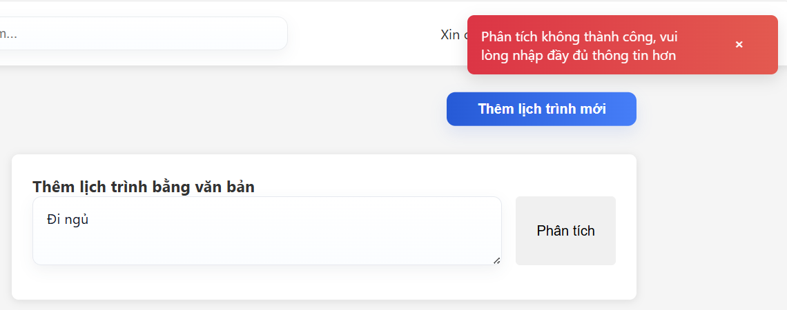
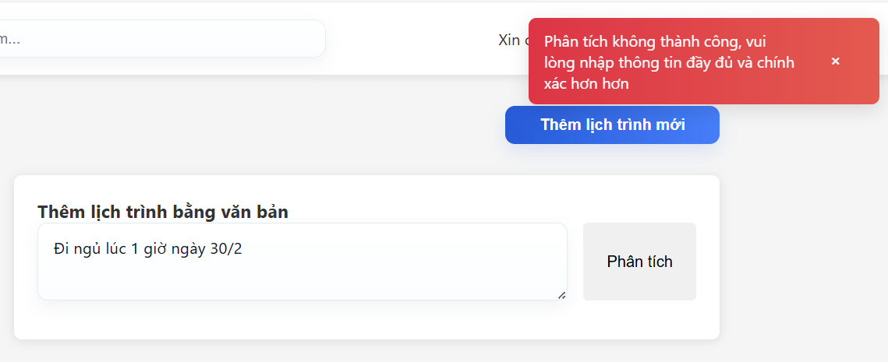

# ĐỒ ÁN CHUYÊN NGÀNH  - Trợ lý quản lý lịch trình cá nhân
Một dự án quản lý sự kiện với NLP (xử lý ngôn ngữ tự nhiên) để tạo/quản lý sự kiện.
# Thông tin sinh viên
- Sinh viên:  ĐINH NGỌC ÂN
- MSSV:       3121410062

# Mô tả dự án
- Backend: API và bộ xử lý NLP để trích xuất thông tin sự kiện (thời gian, địa điểm, tên, ...).
- Frontend: Giao diện React (Vite) cho phép người dùng tạo và xem sự kiện.

### Cấu trúc chính
- `backend/` – mã Python cho API, xử lý NLP và models.
  - `main.py` – điểm vào (server/API).
  - `nlp_processor.py` và `nlp/` – logic xử lý ngôn ngữ.
  - `api/` – route xử lý HTTP.
  - `models/` – định nghĩa mô hình và schema.
  - `tests/` – test cho phần NLP.

- `frontend/` – ứng dụng web (Vite + React).
- `requirements.txt` – phụ thuộc Python chung (gốc).
- `backend/requirements.txt` – phụ thuộc riêng cho backend.

### Yêu cầu
- Python (xem tại https://www.python.org/downloads/)
- Node.js và npm (xem tại https://nodejs.org/en/download)

### Clone dự án về máy
```
git clone https://github.com/DinhNgocAn2003/DACN
```

### Cài đặt ở backend
1. Đến thư mục backend (từ thư mục gốc)
```powershell
cd .\backend\
```
2. Cài node modules và chạy dev server - Với các modules cần thiết đã được liệt kê trong requirement.txt
```powershell
python -m pip install -r requirements.txt 
```
3. Tạo hoặc vào file .env và cấu hình các thông tin về tài khoản email, phục vụ cho quá trình gửi thông báo nhắc nhở lịch trình, cấu hình theo mẫu sau:
```
SMTP_HOST=smtp.gmail.com 		//máy chủ gửi email (Gmail).
SMTP_PORT=465				//cổng kết nối (465 cho SSL).
SMTP_USER= ....@gmail.com		//email gửi đi.
SMTP_PASS= <16 ký tự > // tham khảo lấy tại: https://myaccount.google.com/apppasswords 
FROM_EMAIL=EVENT ASSISTANT 		//tên hiển thị của hệ thống khi gửi
REMINDER_INTERVAL=60			// thời gian nhắc nhở (giây). 
```

### Cài đặt ở frontend
1. Đến thư mục backend (từ thư mục gốc)
```powershell
cd frontend
```
2. Cài đặt npm
```powershell
npm install
```

### Run code
1. Đến thư mục backend (từ thư mục gốc) - DACN/backend
```powershell
cd .\backend\
```
2. Chạy dòng lệnh
```powershell
npm run dev:all
```

### Ghi chú phát triển
- Thay đổi NLP nằm trong `backend/nlp/` — các module tách biệt cho thời gian, địa điểm, tên.
- API routes có trong `backend/api/`.

## Cấu trúc dự án
```
DACN
backend/
┣ api/
┃ ┣ events.py
┃ ┣ nlp.py
┃ ┗ users.py
┣ models/
┃ ┣ models.py
┃ ┣ schemas.py
┃ ┗ __init__.py
┣ nlp/
┃ ┣ datetime_builder.py
┃ ┣ location.py
┃ ┣ name_extractor.py
┃ ┣ preprocess.py
┃ ┣ reminder.py
┃ ┗ time_extractor.py
┣ scripts/
┃ ┣ debugmail.py
┃ ┗ run_nlp_test.py
┣ .env
┣ database.db
┣ db.py
┣ main.py
┣ nlp_processor.py
┣ package-lock.json
┣ package.json
┣ reminders.py
┗ requirements.txt

frontend/
┣ public/
┃ ┗ vite.svg
┣ src/
┃ ┣ assets/
┃ ┃ ┗ react.svg
┃ ┣ components/
┃ ┃ ┣ Auth/
┃ ┃ ┃ ┣ Login.jsx
┃ ┃ ┃ ┗ Register.jsx
┃ ┃ ┣ Common/
┃ ┃ ┃ ┣ ConfirmationModal.jsx
┃ ┃ ┃ ┣ SearchBar.jsx
┃ ┃ ┃ ┣ Toast.jsx
┃ ┃ ┃ ┗ ToastProvider.jsx
┃ ┃ ┣ Events/
┃ ┃ ┃ ┣ Calendar.jsx
┃ ┃ ┃ ┣ EventForm.jsx
┃ ┃ ┃ ┣ EventItem.jsx
┃ ┃ ┃ ┣ EventList.jsx
┃ ┃ ┃ ┗ NLPInput.jsx
┃ ┃ ┗ Layout/
┃ ┃   ┣ Header.jsx
┃ ┃   ┗ Layout.jsx
┃ ┣ services/
┃ ┃ ┣ api.js
┃ ┃ ┗ auth.js
┃ ┣ styles/
┃ ┃ ┗ App.css
┃ ┣ App.jsx
┃ ┗ main.jsx
┣ .env
┣ .gitignore
┣ eslint.config.js
┣ index.html
┣ package-lock.json
┣ package.json
┣ requirement.txt
┗ vite.config.js
```

## Giao diện đăng nhập



## Giao diện trang chính


## Giao diện thêm lịch trình bằng ngôn ngữ thường


# DEMO NLP

## TRƯỜNG HỢP THÀNH CÔNG
## Bước 1. Đăng nhập vào trang chính và nhập text vào ô và chọn "Phân tích"

## Bước 2. Hệ thống phân tích và trả về các trường để người dùng kiểm tra

## Bước 3. Sau khi kiểm tra, người dùng có thể chọn "Thêm vào lịch" để ghi vào database



## TRƯỜNG HỢP KHÔNG THÀNH CÔNG (Không thành công ở bước chọn "Phân tích")
## TH1. Thiếu start_time

## TH2. Start_time không tồn tại

